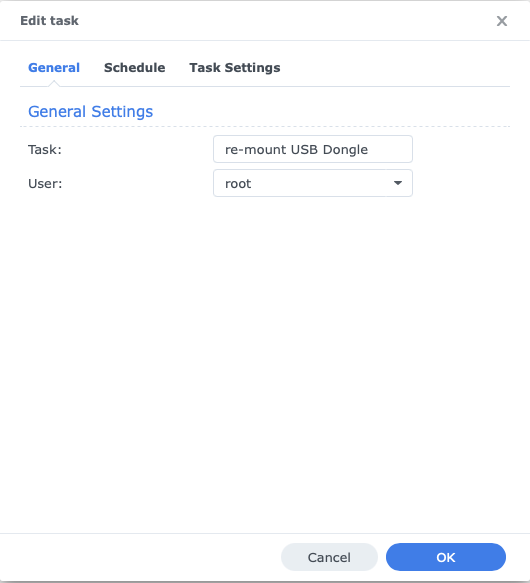
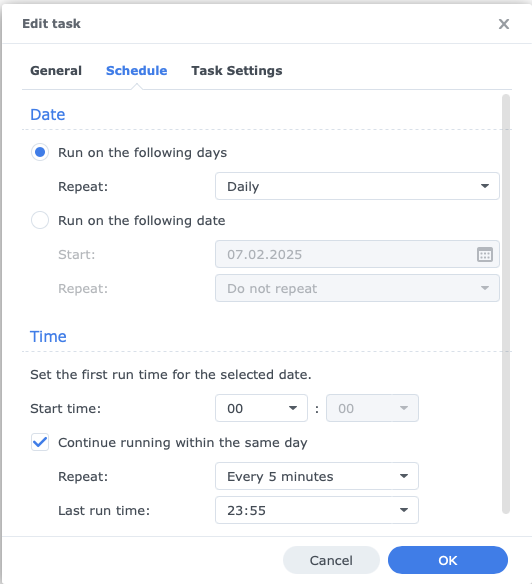
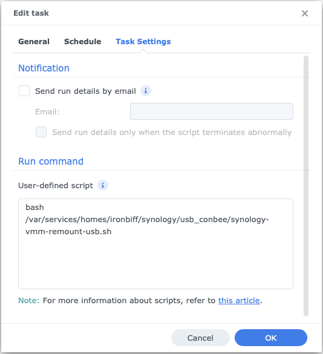

# Automatic USB Remounting for Synology VMM

This script checks whether a specific USB device (e.g., ConBee II) is attached to a virtual machine (VM) in **Synology Virtual Machine Manager (VMM)**. If the device is no longer connected, it will be automatically remounted.

## Prerequisites
- Synology NAS with **Virtual Machine Manager (VMM)**
- SSH access to the NAS
- A USB device that should be passed through to a VM
- VM name
- USB Device Vendor ID

  
## preparation


### **1. Find the USB Vendor ID and Product ID**
Run the following command on the Synology SSH console:
```bash
lsusb
```
Example output:
```
|__usb1          1d6b:0002:0404 09  2.00  480MBit/s 0mA 1IF  (Linux 4.4.302+ xhci-hcd xHCI Host Controller 0000:00:14.0) hub
  |__1-1         214b:7250:0100 09  2.00  480MBit/s 100mA 1IF  ( fffffff6ffffffa3ffffffebffffffcb) hub
    |__1-1.1     1cf1:0030:0100 02  2.01   12MBit/s 100mA 2IFs (dresden elektronik ingenieurtechnik GmbH ConBee II DE2483095)
    |__1-1.2     051d:0002:0006 00  1.10  1.5MBit/s 0mA 1IF  (American Power Conversion Back-UPS CS 500 FW:808.q5.I USB FW:q5 BB0
```
This example is for the ConBee II Dongle
The values **1cf1 (Vendor ID)** and **0030 (Product ID)** are required in the XML file.


### **2. Create an XML file for the USB device**
Save the following file somewhere on your nas for example `/var/services/homes/$USERNAME/synology/usb_conbee/usb_conbee.xml`:

```xml
<hostdev mode='subsystem' type='usb'>
    <source>
        <vendor id='0x1cf1'/>
        <product id='0x0030'/>
    </source>
</hostdev>
```


### **3. Find the VM name (UUID)**
To find the **UUID** or name of your VM, run:
```bash
virsh list
```
Example output:
```
Id   Name                                   State
------------------------------------------------------
 3    b298aa9a-dc43-4ae9-a507-b1333d234705   running
 4    d25ac3aa-76ff-4bb8-972e-dee62d3f914d   running
 5    23986fab-7c4c-4c10-80e2-0fd7d0a55f4b   running
```

### **4. Find the right UUID**
To find the right UUID, run this command with each of your VM UUIDs and use the one where you find the USB attached
```bash
virsh dumpxml d25ac3aa-76ff-4bb8-972e-dee62d3f914d | grep -n5 "1cf1"
```
Example output:
```
298-      <alias name='video0'/>
299-      <address type='pci' domain='0x0000' bus='0x00' slot='0x01' function='0x0'/>
300-    </video>
301-    <hostdev mode='subsystem' type='usb' managed='no'>
302-      <source>
303:        <vendor id='0x1cf1'/>
304-        <product id='0x0030'/>
305-        <address bus='1' device='70'/>
306-      </source>
307-      <alias name='hostdev0'/>
308-      <address type='usb' bus='0' port='2'/>
```


## Installation
1. **Save the script** and
   change '$VENDOR_ID$' to your vendor ID
   change '$IVRSH_VM_NAME$' to your vm Name
   change path to your usb_whatever.xml

2. **Make the script executable**
   ```bash
   chmod +x synology-vmm-remount_usb.sh
   ```

3. **Set up automatic execution**
   To run the script regularly, add a cron job or create a task in synology DSM:
   
   
   
   


## License
MIT License

